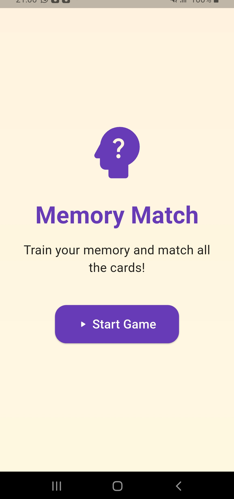
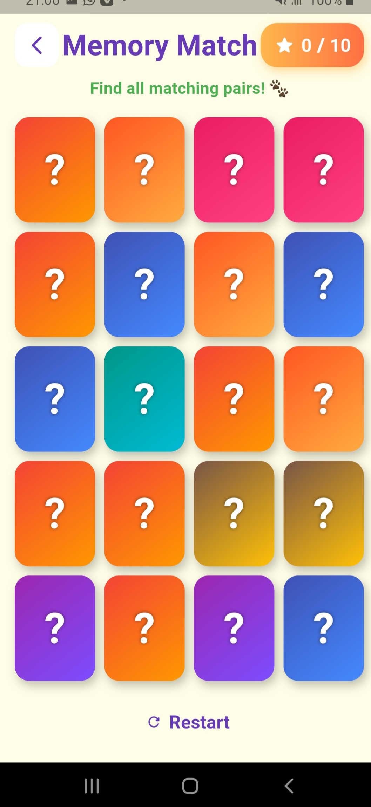
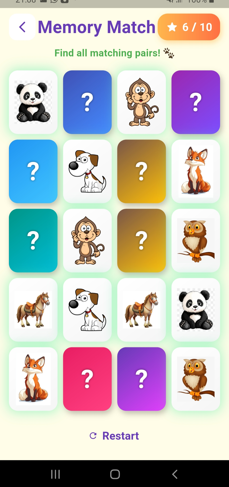
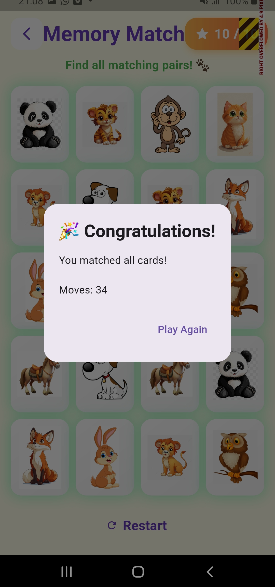
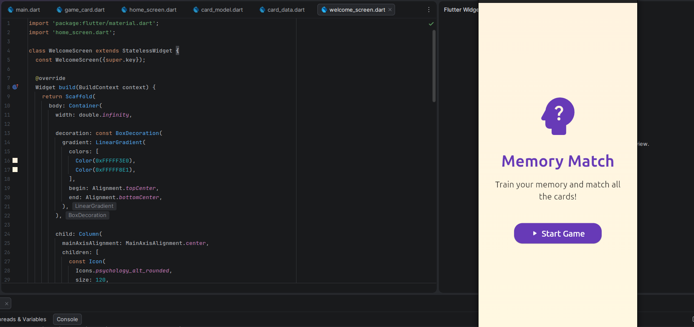
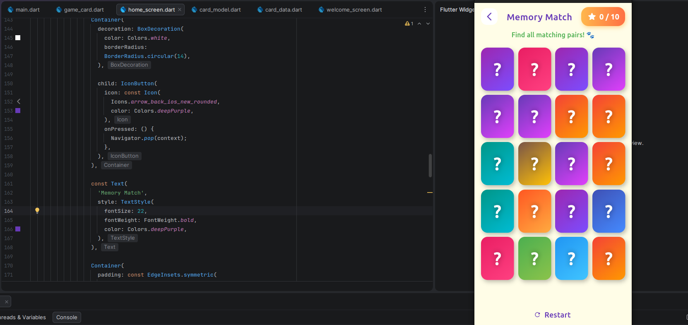
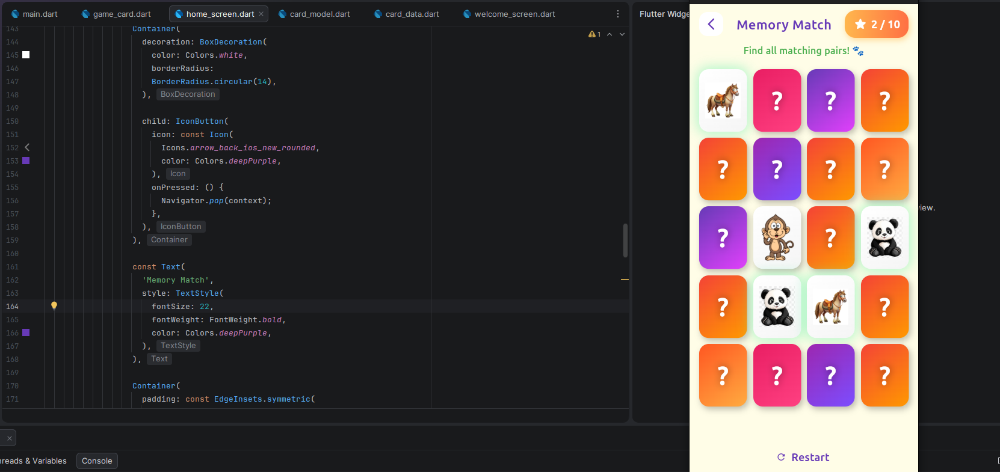
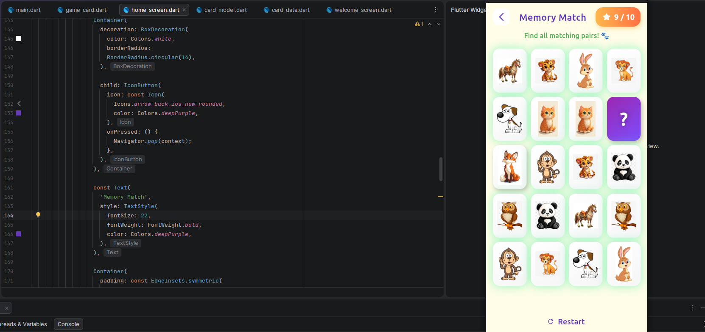
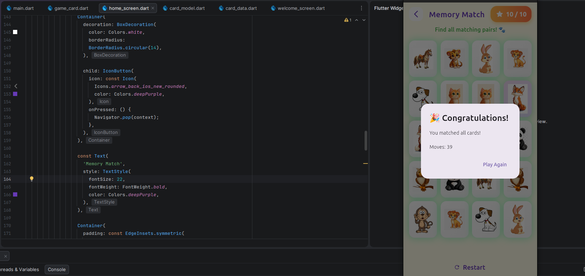

# Memory Match Flutter Game

A modern and responsive Memory Matching Game developed using Flutter and Dart.

This project was created for the Mobile Programming Exercise challenge.

---

## Features

- 4x5 Memory Card Grid
- Animated Card Flipping
- Matching System
- Score Counter
- Move Counter
- Restart Game Button
- Win Dialog Screen
- Responsive UI Design
- Gradient and Modern Styling
- Works on:
  - Android Device
  - Android Emulator
  - Chrome Web
  - Linux Desktop

---

# 📸 Screenshots

## Welcome Screen

<p align="center">
  
</p>

---

## Main Gameplay

<p align="center">
  
  
</p>

---

## Matching Cards

<p align="center">
  
</p>

---

## Responsive Emulator UI

<p align="center">
  
  
</p>

<p align="center">
  
  
</p>

<p align="center">
  
</p>


---

## Project Structure

```text
memory_match_game/
│
├── assets/
│   └── images/
│
├── lib/
│   ├── data/
│   │   └── card_data.dart
│   │
│   ├── models/
│   │   └── card_model.dart
│   │
│   ├── screens/
│   │   └── home_screen.dart
│   │
│   ├── widgets/
│   │   └── game_card.dart
│   │
│   └── main.dart
│
├── screenshots/
│
├── android/
├── ios/
├── web/
├── linux/
├── windows/
├── macos/
│
├── pubspec.yaml
├── README.md
└── README.pdf
